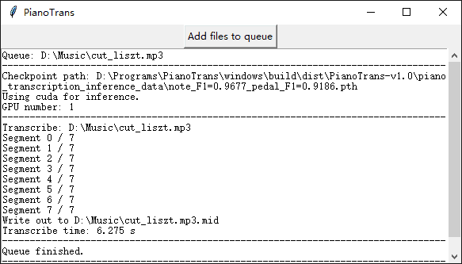
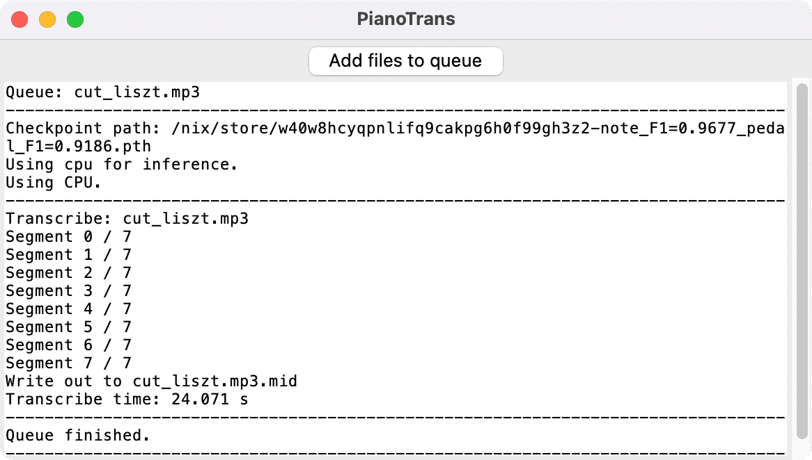
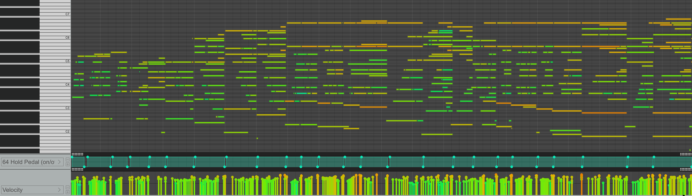

## 字节跳动钢琴转录系统 —— 带踏板的简易 GUI

[](https://github.com/azuwis/pianotrans/actions/workflows/test.yml)

[字节跳动钢琴转录系统][1] 是论文 "High-resolution Piano Transcription with Pedals
by Regressing Onsets and Offsets Times `[1]`" 的 PyTorch 实现。

通过该项目，可将钢琴录音转录为带踏板的 MIDI 文件。

本项目为其提供了简易 GUI 界面，并针对 **Windows** 和 **[Nix（Linux/macOS）][2]** 进行了打包。

<p align="center" float="left">
  
  
  
</p>

### 系统要求

* 操作系统：Windows 7 及以上（64 位）、Linux、macOS（Intel/M1）
* 内存：至少 4 GB
* NVIDIA 50 系（Blackwell）显卡需使用 **v1.1** 及以上版本

已测试环境：Windows 10、Debian Linux 10、macOS 12.1 M1。

### Windows 使用方法

1. 下载安装 [Microsoft Visual C++ Redistributable for Visual Studio 2015, 2017 and 2019][3]（`vc_redist_x64.exe`）
2. 下载并解压 [PianoTrans-v1.0.7z][4]（约 1.5 GB，使用 [7-Zip][5] 解压）
3. 关闭其他应用程序以释放内存，至少需要 2 GB 可用内存
4. 进入 `PianoTrans` 目录，运行 `PianoTrans.exe`
5. 选择音频/视频文件，按住 `CTRL` 可多选
6. 生成的 MIDI 文件位于输入文件所在目录

如需右键菜单功能，运行 `RightClickMenuRegister.bat`，之后即可选中多个音频/视频文件，右键选择「Piano Transcribe」进行转录。

PianoTrans 默认自动使用 GPU 进行推理，如遇问题可尝试运行 `PianoTrans-CPU.bat` 强制使用 CPU。

### Linux/macOS 使用方法（Nix）

> **注意：** 本教程适用于 [Nix][2] 包管理器（Linux/macOS）。如不使用 Nix，也可参照上游项目 [安装与使用指南][6]，通过 Python pip 方式安装。

1. 打开终端
2. 安装并配置 Nix：
   ```sh
   sh <(curl -L https://nixos.org/nix/install) --daemon
   mkdir -p ~/.config/nix
   echo 'experimental-features = nix-command flakes' > ~/.config/nix/nix.conf
   ```
   详见 https://nixos.org/download.html
3. 使用 Nix 安装 pianotrans：
   ```sh
   nix profile install github:azuwis/pianotrans
   ```
4. 运行 `pianotrans` 打开 GUI，选择音频/视频文件，按住 `CTRL`（macOS 为 `⌘`）可多选

命令行用法：直接运行 `pianotrans 文件1 文件2 ...`。

升级 pianotrans：
```sh
$ nix profile list
0 github:azuwis/pianotrans#defaultPackage.aarch64-linux github:azuwis/pianotrans/e19d5fd12f4295816fad49f6398e2e53ed2d2b7a#defaultPackage.aarch64-linux /nix/store/zdalndvcralish8d43drzslv0p4pm97v-python3.9-pianotrans-0.2.1
# 列出 Nix profile，`0` 即为 pianotrans
$ nix --option tarball-ttl 1 profile upgrade 0
$ nix profile list
0 github:azuwis/pianotrans#defaultPackage.aarch64-linux github:azuwis/pianotrans/e944720dd0dfcc2b87dcc39c1fdaab086eba4ca6#defaultPackage.aarch64-linux /nix/store/rv5iikrdvc7jrc7mqs8mkc21qh2gklhx-python3.9-pianotrans-1.0
# pianotrans 已升级至 v1.0
```

[1]: https://github.com/bytedance/piano_transcription
[2]: https://nixos.org
[3]: https://support.microsoft.com/en-us/help/2977003/the-latest-supported-visual-c-downloads
[4]: https://github.com/azuwis/PianoTrans/releases/download/v1.0/PianoTrans-v1.0.7z
[5]: https://www.7-zip.org/download.html
[6]: https://github.com/qiuqiangkong/piano_transcription_inference

### 常见问题

**问：能否改善转录效果？**

答：本项目仅对 https://github.com/bytedance/piano_transcription 进行封装打包，只要能输出 MIDI 文件，其他问题均不在本项目范围内。

请向上游项目反馈：https://github.com/bytedance/piano_transcription/issues

### 更新日志

#### [1.1] - 2025-07-02

* 升级 PyTorch 至 2.7.1+cu128，新增 NVIDIA 50 系（Blackwell）显卡支持
* 升级 Python 至 3.12，librosa 至 0.9.2
* 更新 FFmpeg、7-Zip 等打包组件
* 新增 GitHub Actions 自动构建流水线（Windows）

#### [1.0.1] - 2023-02-09

* 新增 `--cli` 选项强制禁用 GUI
* 移除 askopenfilenames 的 filetypes 参数以避免崩溃
* 更新 Nix flake，移除 mido/soundfile/torchlibrosa/piano-transcription-inference overlay，所有补丁已合入 nixpkgs，更多依赖可直接从 Nix 二进制缓存获取，减少本地编译
* 新增 GitHub 测试流水线

#### [1.0] - 2022-02-21

* 支持 Linux/macOS（通过 Nix）
* 全平台：
  - 在 CLI 之外新增完整的 GUI 界面
  - GUI 支持将文件添加到转录队列
* Windows：
  - 右键菜单支持多文件（需重新运行 `RightClickMenuRegister.bat`）
  - 更新 PyTorch 至 1.10.2

#### [0.2.1] - 2021-12-23

* 更新 PyTorch 至 1.10.1
* 更新 piano-transcription-inference 至 0.0.5

#### [0.2] - 2021-09-27

* 更新 PyTorch 至 1.9.1
* 新增 PianoTrans-CPU.bat 强制使用 CPU 推理

#### [0.1] - 2021-02-02

* 首次发布

## 引用

`[1]` Qiuqiang Kong, Bochen Li, Xuchen Song, Yuan Wan, and Yuxuan Wang. "High-resolution Piano Transcription with Pedals by Regressing Onsets and Offsets Times." arXiv preprint arXiv:2010.01815 (2020). [[pdf]](https://arxiv.org/pdf/2010.01815.pdf)
